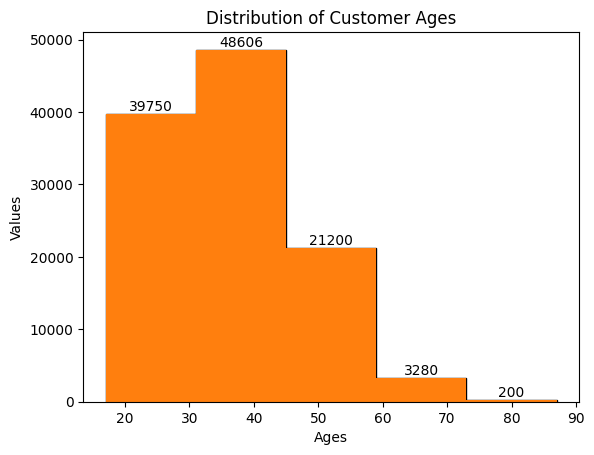
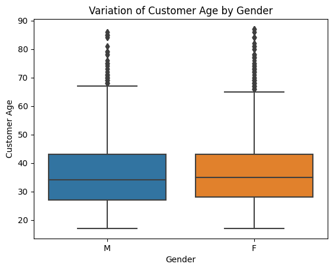

# Sales Data Analysis Dashboard

## Overview
This repository contains code for a sales data analysis dashboard built using Python and popular data visualization libraries. The dashboard provides insights into customer demographics, product performance, and profitability based on a provided CSV dataset.

## Features
- Visualizations include histograms, bar plots, and pie charts to represent key metrics.
- Data analysis covers customer age distribution, order quantities, popular product categories, and more.
- Simple and beginner-friendly Python code for data manipulation and visualization.

## Requirements
- Python 3.x
- Pandas
- Matplotlib
- Seaborn (optional, for more advanced visualizations)

## Usage
1. Clone the repository to your local machine.
2. Place your sales data CSV file in the same directory.
3. Update the file path in the Python scripts to match your CSV file.
4. Run the Python scripts to generate the visualizations.
5. Explore the generated visualizations to gain insights from your sales data.

## Directory Structure
- `project.ipynb`: Python script for data analysis and visualization.
- `sales_data.csv`: Placeholder for your sales data CSV file.
- `README.md`: Documentation detailing project overview, features, requirements, and usage instructions.

## Examples

*Figure 1: Distribution of Customer Ages*

*Figure 2: Variation of Customer Age by Gender*

## To view the dashboard
https://nbviewer.org/github/sriharsha9966/python_sales/blob/main/project.ipynb

